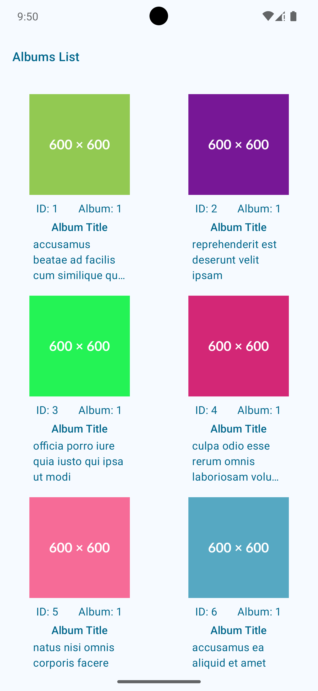
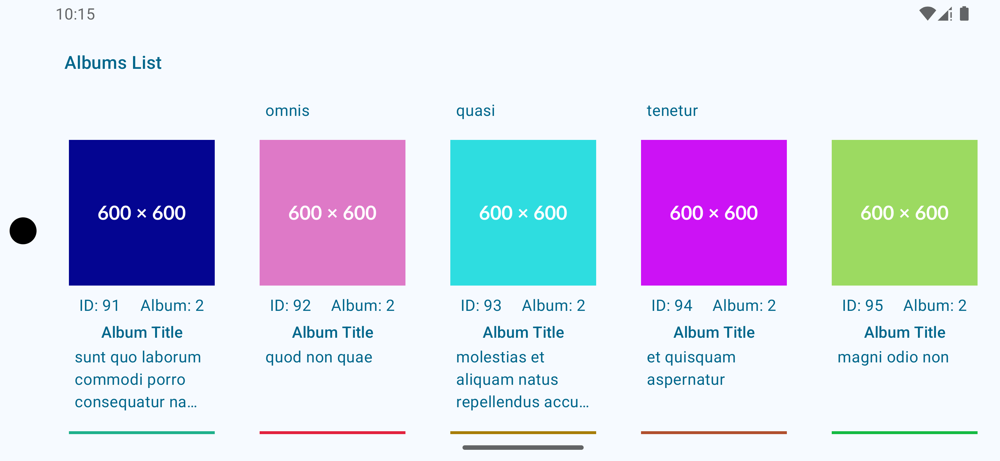

# AlbumApp

A modern Android application that retrieves and displays a list of albums from a remote JSON endpoint. Built with a focus on clean architecture, offline support, performance, and testability.

## Description

AlbumApp fetches and displays a list of albums using a REST API. Each album item includes a title and image. The app includes local persistence to ensure that content is available even when offline or after a device reboot.

## Features

- **Album Listing**: Displays albums with title and image using a clean grid layout.
- **Offline Availability**: Albums are stored locally using Room so users can access them without internet.
- **Pull-to-Refresh**: Allows users to refresh album data manually.
- **Error Handling**: UI gracefully handles errors and network loss with retryable snackbars.
- **Pagination**: Efficient loading and display of large datasets using Paging 3.

## Screenshots
### 🖼️ Portrait Mode

  
  

### 🖼️ Landscape Mode

## 🎥 Demo

▶️ [Watch the app demo](media/appDemo.mp4)

---

##  Libraries

- [Kotlin](https://kotlinlang.org/)
- [Coroutines](https://kotlinlang.org/docs/coroutines-overview.html)
- [Flow](https://kotlinlang.org/api/kotlinx.coroutines/kotlinx-coroutines-core/kotlinx.coroutines.flow/-flow/)
- [Jetpack Compose](https://developer.android.com/jetpack/compose)
- [Retrofit](https://square.github.io/retrofit/)
- [Hilt](https://developer.android.com/training/dependency-injection/hilt-android)
- [Room](https://developer.android.com/training/data-storage/room)
- [Coil](https://coil-kt.github.io/coil/)
- [Paging 3](https://developer.android.com/topic/libraries/architecture/paging/v3-overview)

---

## Testing Libraries

- [JUnit4](https://junit.org/junit4/)
- [MockK](https://mockk.io/)
- [Turbine](https://github.com/cashapp/turbine) – Flow testing
- [Truth](https://truth.dev/) – Readable assertions

---

## Architecture & Design Decisions

### 🧱 Clean Architecture
This architecture promotes separation of concerns and modularity:

- **Data Layer**: Handles local DB and remote API operations. Maps DTOs to domain models.
- **Domain Layer**: Contains use cases and business logic, shared between data and presentation.
- **Presentation Layer**: ViewModels expose state to the UI. Jetpack Compose handles rendering.

### 🎭 MVVM Pattern
The app uses the Model-View-ViewModel (MVVM) pattern. ViewModels expose UI state as `StateFlow`, and the UI reacts declaratively.

### 🗄️ Room Database
Used to cache the album list locally. Enables offline support and seamless user experience on restarts.

### 🔄 Paging 3
Used to load and display large album datasets efficiently from the local database, minimizing memory consumption.

### 🔌 Dependency Injection
Hilt is used to manage and inject dependencies throughout the app, including ViewModels, use cases, repositories, and system services.

---

## Testing Strategy

- **Unit Tests**:
    - ViewModels
    - UseCases
    - Repository logic with mocked data sources
- **UI Tests**:
    - Compose UI rendering
    - Snackbar visibility
    - Empty and error state rendering
- **Flow Tests**:
    - Turbine is used to assert `Flow` behavior in ViewModels and use cases.
---

## 🔮 Future Improvements

1. **Modularization**  
   Split the app into modules (e.g., `core`, `feature-albums`, `data`) for improved scalability and team development efficiency.

2. **Better Connectivity Handling**  
   Persist connectivity status and retry logic more robustly using `ConnectivityManager` callbacks or WorkManager constraints.

3. **Responsive Design**  
   Improve support for tablets, foldables, and landscape orientation through adaptive layouts.

4. **Build Optimization**  
   Add Gradle build optimizations, dependency version catalogs, and CI/CD setup for streamlined deployment and faster builds.

5. **Album Detail Screen**  
    Implement a detailed view for each album, including additional metadata and user interactions, like favorites or sharing.